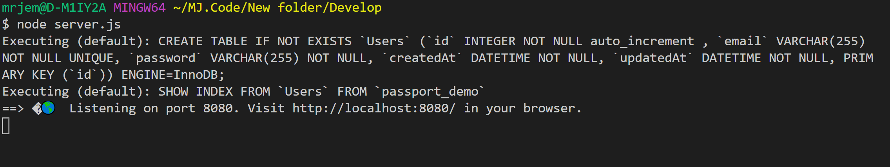

# Sequelize Reverse Engineering Code tutorial

[](https://shields.io/)

[Repo: Sequelize-Reverse-Engineering-Code](https://github.com/Jones-M12/Sequelize-Reverse-Engineering-Code)


## Purpose

This document explains the overall structure of the Sequelize Passport code. A code structure is provided, and within the structure a breakdown of each file is explained.
IT is very helpful to understand how different folders and files work together to produce a working application.

## Code Overview

You will see the file it setup is the same as the structure below:

```
.
├── config--> 📂 Folder contains configuration settings and middleware components that interact with the 
|   |              application to support verification metrics and route path direction.
|   |
|   ├── middleware
|   |        └── isAuthenticated.js
|   |               └──> ## This file is used to direct the path of the user. If the use wishes to reach
|   |                       the member page they must be logged in or else they will be restricted from 
|   |                       doing so and will be directed to the login page.
|   |
│   ├── config.json
|   |       └──> ## Initiates the connection to MySQL
|   |
│   └── passport.js
|           └──> ## Used to support configuration and managing request for things like HTTP request for 
|                   getting information and serving webpages related to an account. It defines the 
|                   parameters the user must provide in order to have access to the application, email 
|                   and password conditions. Moreover, it confirms the existence of a user and assists 
|                   with directing the route path accordingly.
│ 
│ 
│ 
│ 
├── models--> 📂 Folder contains dependencies that are used to create Sequelize tables.
|   |
│   ├── index.js
|   |       └──> ## provides the ability to allow all models within the models folders to be references 
|   |               when needed.   
|   |               
│   └── user.js
│          └──> ## Sequelize Model that represents a table.
|                  Note: Sequelize creates the table for us.
|                        Sequelize default, it will auto create a primary ID for each entry, a
|                        built in feature.
│                         
│
│
│
├── public--> 📂 Folder handles all clients side code.
|   |
│   ├── js--> # Folder handles the user interface interactions that process input to be used in
|   |    |       conjunction with the server to handle request.
|   |    |
|   |    ├── login.js
|   |    |      └──> ## Contains reference to dependencies that handle on click events for login, 
|   |    |              verifying account exist with email and password match.
|   |    |              If correct, redirects user to the member page. Also is dependent on 
|   |    |              the corresponding HTML file.
|   |    |
|   |    ├── members.js
|   |    |      └──> ## Verifies which user is logged in on based on the accounting formation that
|   |    |               used to login, displaying the user welcome message or specific 
|   |    |               information relate to that user. Also is dependent on the 
|   |    |                corresponding HTML file.
|   |    |              
|   |    └── signup.js
|   |           └──> ## Contains reference to dependencies that handle on click events for signing, 
|   |                   verifying account does not exist already. Successful sign up will redirect a 
|   |                   user to the member page. Else, user will be redirected to
|   |                   the login page. Also is dependent on the corresponding HTML file.
|   |
│   ├── stylesheets
|   |     └── style.css
|   |            └──> ## Handles page styling, the visual display seen by the client.
|   |
|   ├── login.html
|   |       └──> ## markup language document for the login page display, 
|   |               supported by the stylesheet and corresponding JS file.
|   |
|   ├── members.html
|   |       └──> ## markup language document for the member page display, 
|   |               supported by the stylesheet and corresponding JS file.
|   |
│   └── signup.html
|          └──> ## markup language document for the sign-up page display, 
|                  supported by the stylesheet and corresponding JS file.
|  
|  
|  
|
├── routes--> 📂 Folder contains files that handle receiving request and performing operations needed 
|   |              and serving responses, which may include JSON or HTML data.
|   |
│   ├── api-routes.js
|   |       └──> ## File offers a set of routes for displaying and saving data to the database. It 
|   |               references dependencies to the models and config folders.
|   |               This supports interactions with Sequelize tables and verifying user authentication.
|   |               This is where sever side GET & POST methods are used. 
|   |
│   └── html-routes.js
│              └──> ## File offers a set of routes for displaying and reading data from the database. It 
|                     references dependencies to the corresponding HTML files and the config folder.
|                     Here, user input is verified using the middleware authentication. 
|                     Based on user input, they redirected to the proper page.
|   
|   
|   
├── package.json
|       └──> ## file used to store all the dependencies that are associated with and used for the project.
│
│
|   
└──server.js
    └──> ## This is where the rest of the magic happens. Inside this file all the references to required 
            dependencies are list. It references dependencies to the config folder, models folder, 
            everything in the public folder, and the routes folder. This is where the port setup, 
            creation to express application, middle configuration, and routes dependencies requirements 
            all take place in order to sync the database together to allow the application to function.
```

## How to Add Changes

Steps:

1. run 'nmp install' -- creates package.lock.json
                            └──> this file keep track of all packages you have installed and the specific version.

2. Create a schema file or create a database 📂 with a schema file inside.

    Copy and paste the lines below into the schema file.

        DROP DATABASE IF EXISTS `insert the name of your database here`;
        CREATE DATABASE `insert the name of your database here`;

    Next, replace only the text, entering the name of your database.

3. Navigate to the 📂 config
                         └──> config.json
                                    └──> Inside this file, the development object properties need to be changed.
                                        This information needs to match the credentials of the database you are using. 
                                        In this case MySQL Workbench is being used. Look at the MySQL Connections section.

        a. username- Should be set to root. If not, change to your username for MySQL

        b. database- The name of the database was written in the schema file, input that name here too.

        c. host- This should be the same, update it if not.

        d. dialect- reference to the database being using, which is MySQL in this case. Writing it in lowercase letters. 

4. Open MySQL Workbench. Select file --> hit new query tab. Inside this tab, hit the 📂 icon, find the path to the schema file for this project. 

    Select the file, hit open, and it will import into the query tab. Now hit the ⚡ lightning bolt icon, the one next to the 💾 floppy disk icon.

    This will create the database in MySQL, which supports the connection to Sequelize in order to get the application functioning.

5. Now, in VS Code, open a terminal, navigate into the root folder, and run 'node server.js'. 

    Should get a similar response after running the command:

    

6. Now, if you hover over the URL displaying in the terminal from step 5, notice it is clickable.

    Click the link & it will open the application in the web browser. You can test it out and see how things work. You can start making changes once comfortable with how things are working.

7. Depending on how you want to design your application, you would create models in the models 📂 that will represent the tables that will be in your database.

8. Next, head to the public 📂---> Create any additional needed HTML pages that will correspond with you new tables or update the current members.html file.

9. Create any corresponding JS file needed to suport the new HTML pages or the updated page. This is done in the public 📂, then navigate to the js 📂 and start create needed files within.

10. For now, let's just update the members.html content. We can add in mark language to support a header, footer, a menu bar, and movie ticket search field.

    Note: the movie data would be a table created inside the models folders. This allows a user to search for data that will include movie times, the prices, and location of the viewing.

11. Style the members.html using the stylesheet, navigate to this 📂 to do so.

12. Create a members-routes.js file within the routes 📂 to handle sever side interactions to the database that are associated with content on the members.html. 

    Note: This would include dependencies to the models folder and routes for displaying data.
          Add this new route into the server.js
                                                                                                                    
13. I think you got it from here. Good luck! Don't forget to save and remember the power of Google Fu! 😉
                                                                                                           

## Contact Information

* GitHub: [Jones-M12](https://github.com/Jones-M12) 

* Email: malesharj@gmail.com 

* LinkedIn: [m-jones89](https://www.linkedin.com/in/m-jones89/)


